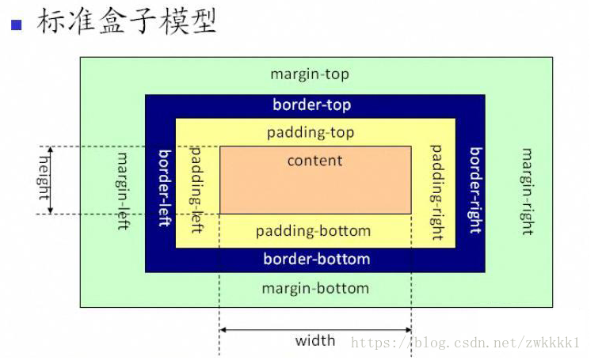
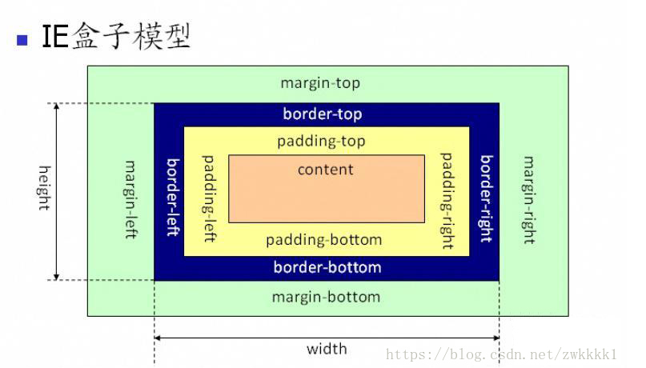

## css的两种盒模型

### W3C的标准盒模型



    在标准的盒子模型中，width指content部分的宽度

IE的盒模型



    在IE盒子模型中，width表示content+padding+border这三个部分的宽度 

我们可以看出我们上面的使用的默认正是W3C标准盒模型
而这里盒模型的选取更倾向于项目和开发者的习惯，并没有绝对的好坏之分。

## box-sizing的使用

如果想要切换盒模型也很简单，这里需要借助css3的box-sizing属性
```css
	box-sizing: content-box /*是W3C盒子模型*/
	box-sizing: border-box  /*是IE盒子模型*/
```
	
box-sizing的默认属性是content-box

## 浏览器的兼容性问题

一旦为页面设置了恰当的 DTD，大多数浏览器都会按照上面的图示来呈现内容。然而 IE 5 和 6 的呈现却是不正确的。根据 W3C 的规范，元素内容占据的空间是由 width 属性设置的，而内容周围的 padding 和 border 值是另外计算的。不幸的是，IE5.X 和 6 在怪异模式中使用自己的非标准模型。这些浏览器的 width 属性不是内容的宽度，而是内容、内边距和边框的宽度的总和。
虽然有方法解决这个问题。但是目前最好的解决方案是回避这个问题。也就是，不要给元素添加具有指定宽度的内边距，而是尝试将内边距或外边距添加到元素的父元素和子元素。
IE8 及更早IE版本不支持设置填充的宽度和边框的宽度属性。
解决IE8及更早版本不兼容问题可以在HTML页面声明 <!DOCTYPE html>即可。
