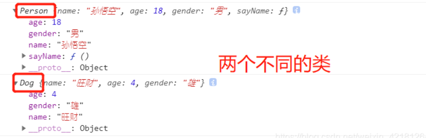
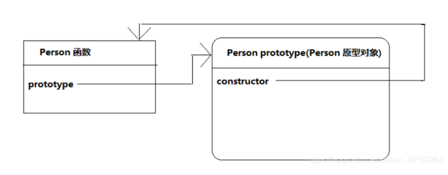
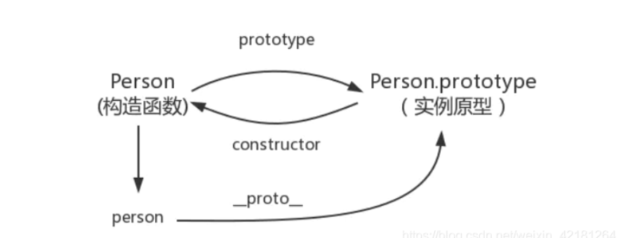
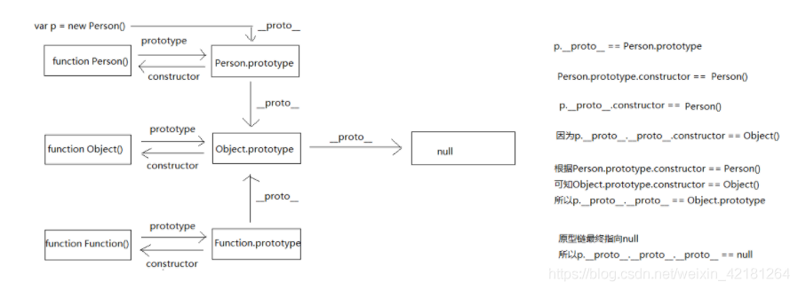

## 1. 构造函数
	
构造函数，是一种特殊的方法，主要用来创建对象时初始化对象，即为成员对象变量赋初始值，总与new运算符一起使用再创建对象的语句中。特别是一个类可以有多个构造函数，可根据其参数个数不同或参数类型不同区分它们，即构造函数的重载。
	
构造函数和普通函数的创建都相同，不同的是习惯上构造函数首字母大写。另外就是调用方式不同，普通函数直接调用，构造函数需要使用new关键字来调用。

```js
function Person(name, age, gender) { 
    this.name = name 
    this.age = age 
    this.gender = gender 
    this.sayName = function () { 
        alert(this.name); 
    }
    } 
var per = new Person("孙悟空", 18, "男"); 
function Dog(name, age, gender) { 
    this.name = name 
    this.age = age 
    this.gender = gender 
} 
var dog = new Dog("旺财", 4, "雄") 
console.log(per);//当我们直接在页面中打印一个对象时，事件上是输出的对象的toString()方法的返回值 console.log(dog);
```


	
每创建一个Person构造函数，再Person构造函数中，为每一个对象都添加了一个sayName方法，也就是说构造函数每执行一次就会创建一个新的sayName方法。这样就导致构造函数执行一次就会创建一个方法，执行1000次就会创建1000个新的方法，而这1000个方法都是一模一样的，原型（prototype)可以把这个方法单独放到一个地方，并让所有的实例都可以访问到。
 
## 2. 原型
	
在JavaScript中创建一个函数A，那么浏览器中就会创建一个对象B，每个函数都默认会有一个属性prototype指向这个对象（即：prototype的属性的值是这个对象）。这个对象B就是函数A的原型对象，即为原型。这个原型对象B默认会有一个属性constructor指向函数A，就是constructor属性的值是函数A


	
## 3. 原型链
	
每一个对象的数据类型（普通对象、实例、prototype）也自带一个属性_proto_，属性值是当前实例所属类的原型，原型对象中有一个属性constructor指向原本的函数对象。

```js	
function Person() {} 
var person = new Person() 
console.log(person.__proto__ === Person.prototype)//true 

console.log(Person.prototype.constructor===Person)//true 

console.log(Object.getPrototypeOf(person) === Person.prototype) // true
```


	
在JavaScript中万物都是对象，对象和对象之间也有关系。对象的继承关系通过prototype对象指向父类对象直到指向object对象为止，这样的链即为原型链。person->Person->Object
	
当访问对象的额一个属性或者方法时，它会先再对象的自身中寻找，如果有直接使用，没有则会去原型对象中寻找，如果找到直接使用，没有找到就顺着原型链接着找，直到找到Object对象的原型。object对象的原型没有原型，如果object原型中依然没有找到就返回undefined
	
## 5. 原型和原型链
	
```js
Function.prototype.a = "a"; 
Object.prototype.b = "b"; 
function Person(){} 
console.log(Person); //function Person() 
let p = new Person(); 
console.log(p); //Person {} 对象 
console.log(p.a); //undefined 
console.log(p.b); //b 
console.log(p.__proto__.constructor); //function Person(){} 
console.log(p.__proto__.__proto__); //对象{}，拥有很多属性值 
console.log(p.__proto__.__proto__.__proto__); //null 
console.log(Object.prototype.__proto__); //null //Function 
function Function(){} console.log(Function); //Function() 
console.log(Function.prototype.constructor); //Function() 
console.log(Function.prototype.__proto__); //Object.prototype 
console.log(Function.prototype.__proto__.__proto__); //NULL 
console.log(Function.prototype.__proto__.constructor); //Object() 
console.log(Function.prototype.__proto__ === Object.prototype); //true
```



## 6. 属性或方法
	
#### Prototype

prototype属性存在于构造函数中，任何函数都有，指向了这个构造函数的原型对象
	
#### constructor属性

constructor属性存在于原型链中，指向了构造函数
	
```js
function Person(){}
Person.prototype.constructor === Person // true
var p1 = new Person();
p1 instanceof Person // true

Person.prototype = {
    name:  'xxx'
}
p1.name; // xxx
p1 instanceof Person  // true
Person.prototype.constructor === Person // false
```
	
当使用对象字面量来重写原型对象时，会改变其constructor属性，会使其指向Object构造函数，而不是原有的对象。
	
#### _proto_属性
	
用构造方法创建一个新对象之后，这个对象中默认会有一个不可访问的属性[[prototype]], 这个属性指向了构造方法的原型对象
	
#### hasOwnProperty()方法
	
对象的hasOwnProperty()可以检查对象自身中是否含有该属性，但是不能判断是否存在于原型链中，因为有可能这个属性不存在。也就是说，在原型中的属性和不存在的属性都会返回false。

```js	
function Person(){}
Person.prototype.a = 123;
Person.prototype.sayHello = function(){
    //
};
var person = new Person();
person.a // 123
person.hasOwnProperty('a') // false
'a' in person // true
```
	
person实例中没有a的属性，从person对象中找不到a属性就会从person的原型也就是person._proto_，也就是Person.prototype中查找，a=123
	
但是当实例的属性（person._proto_)没有找到，就会查到与对象关联的原型的原型中的属性，如果查不到就去找原型的原型，一直到最顶层Object为止，Object时JavaScript中所有对象数据类型的基类，在Object.prototype上没有_proto_属性。
	
#### in操作符
	
in操作符用来判断一个属性是否存在于这个对象中。但是在查找这个属性的时候，先在对象本身中查找，如果对象找不到再去原型中查找。也就是只要对象和原型中有一个地方存在这个属性就返回true
	
如果一个属性存在，但是没有在对象本身中，name一定在原型中
	
```js
Object.prototype._ptoto_ === null // true
```
	
## 7. 原型模型和构造函数模型组合来创建对象
	
#### 原型模型创建对象的缺陷
	
原型中所有的属性都是共享的。也就是说用同一个构造函数创建的对象去访问原型中的属性的时候，大家都是访问的同一个对象，如果一个对象对原型的属性进行了修改，则会反映到所有的对象上去。属性共享对于方法（属性值是函数）很适合。
	
但在实际过程中，对象的属性一般是不同的。
	
#### 构造函数模型创建对象的缺陷
	
在构造函数中添加的属性和方法，每个对象都有自己的独一份，大家不会共享，这个特性对属性合适，但是对方法不合适。因为对于对象来说，他们的方法是一份就够了，不需要每一个对象都有一份，造成性能浪费和性能低下。
	
```js
function Person() { 
    this.name = "李四"; 
    this.age = 20; 
    this.eat = function() { 
        alert("吃完东西"); 
    } 
} 
var p1 = new Person(); 
var p2 = new Person(); //每个对象都会有不同的方法 
alert(p1.eat === p2.eat); //fasle

// 可以使用下面的方法解决

function Person() { 
    this.name = "李四"; 
    this.age = 20; 
    this.eat = eat; 
} 
function eat() { 
    alert("吃完东西"); 
} 
var p1 = new Person(); 
var p2 = new Person(); //因为eat属性都是赋值的同一个函数，所以是true 
alert(p1.eat === p2.eat); //true
```
	
但是这种方法具有致命缺陷：封装性太差。使用面向对象，目的之一就是封装代码，这个时候为了性能又把代码抽出对象之外，与设计目的相反。
	
#### 组合模式
	
构造函数模型适合封装属性，原型模式适合封装属性，组合两种模式来构造对象

```js
//在构造方法内部封装属性 
function Person(name, age) { 
    this.name = name; 
    this.age = age; 
}
    //在原型对象内封装方法 
Person.prototype.eat = function (food) { 
    alert(this.name + "爱吃" + food); 
} 
Person.prototype.play = function (playName) { 
    alert(this.name + "爱玩" + playName); 
} 
var p1 = new Person("李四", 20); 
var p2 = new Person("张三", 30); 
p1.eat("苹果"); 
p2.eat("香蕉"); 
p1.play("志玲"); 
p2.play("凤姐")
```