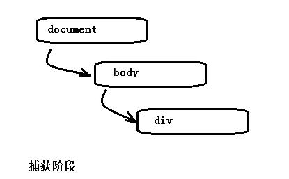
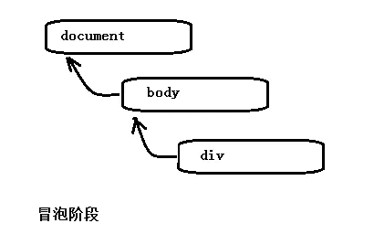

## 1. 捕获阶段
	
事件从根节点流向目标节点，途中流经各个DOM节点，在各个节点触发捕获事件，直到到达目标节点
	

	
## 2. 目标阶段
	
事件到达目标节点时，就到了目标阶段，事件在目标节点上被触发
	
## 3. 冒泡阶段
	
事件在目标节点上触发后不会终止，一层层向上冒泡，回溯到根节点

	
    冒泡阶段可以人为干预，事件到当前节点后阻止事件向上冒泡，而另外两个阶段不能人为干预